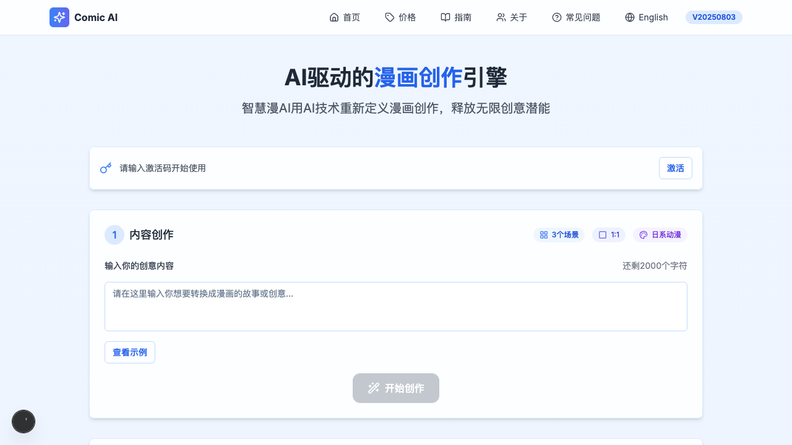

# Comic Generator / 智绘漫 AI

[](https://github.com/kingxiaozhe/comic-generator/actions/workflows/ci.yml)
[](LICENSE)

把故事或创意转换为漫画分镜脚本，再按选定的视觉风格生成图片。项目使用
Next.js、TypeScript、SiliconFlow 文本模型与 Volcengine ARK 图像模型，
支持中英文界面、多种画面比例、场景数量和风格参数。



## 功能

- 从故事文本生成结构化多场景漫画脚本
- 单场景重写与多场景连续生成
- 日漫、美漫、写实、卡通、素描、水彩等视觉风格
- 1:1、3:4、4:3、16:9、9:16 画面比例
- 角色描述提取与跨场景一致性提示
- 中文 / English 界面与响应式工作台

## 本地运行

需要 Node.js 18.17+ 和 pnpm 8+。

```bash
git clone https://github.com/kingxiaozhe/comic-generator.git
cd comic-generator
corepack pnpm@8.15.6 install --frozen-lockfile
cp .env.example .env.local
```

在 `.env.local` 中配置你自己的服务端密钥：

```dotenv
DEEPSEEK_API_KEY=your-siliconflow-api-key
ARK_API_KEY=your-volcengine-ark-api-key
```

然后启动：

```bash
corepack pnpm@8.15.6 dev
```

访问 `http://localhost:3000/zh` 或 `http://localhost:3000/en`。

## 验证

```bash
corepack pnpm@8.15.6 audit --prod
corepack pnpm@8.15.6 exec tsc --noEmit
DEEPSEEK_API_KEY=test-placeholder \
ARK_API_KEY=test-placeholder \
corepack pnpm@8.15.6 build
```

CI 会从锁文件安装依赖、审计生产依赖、执行 TypeScript 检查并完成生产构建。

## 部署

导入 Vercel 或其他 Next.js 运行环境后，在部署平台的加密环境设置中配置
`DEEPSEEK_API_KEY` 与 `ARK_API_KEY`。这两个变量仅供服务端 API Route 使用，
不要放入 `next.config.mjs`、客户端变量、日志或仓库文件。

当前仓库不声明公开 Demo URL：此前配置的 GitHub Homepage 域名指向了另一套
应用，已从仓库元数据移除。重新绑定并匿名验证正确部署后再恢复。

## 安全说明

仓库曾经提交过明文 API 凭据。当前默认分支已经删除这些值、移除编辑器历史
快照、修复客户端环境注入，并升级到无已知生产依赖漏洞的版本；但 Git 历史中
仍可能保留旧值。仓库所有者必须在 SiliconFlow 和 Volcengine 控制台撤销并
重新生成相关凭据。详见 [SECURITY.md](SECURITY.md)。

## 许可证

[MIT](LICENSE)
